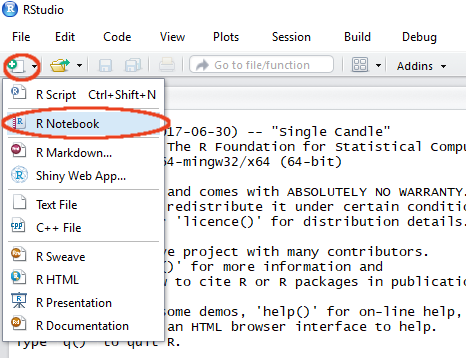

```{r setup, include=FALSE}
knitr::opts_chunk$set(echo = FALSE)
```

# Getting started
## RStudio
```{r, out.width = "800px"}

```

## RStudio
```{r, out.width="800px"}
knitr::include_graphics("figures/RStudio_startup_labelled.png")
```

<div class="notes">
* Could start working now by typing R commands, but better to keep a record of
  what we are doing.
* Notebooks integrate R code with comments and and output.
</div>

## Notebooks
```{r, out.width="800px"}

```
