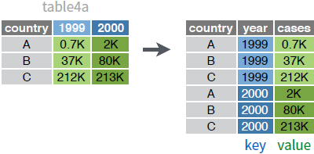

```{r setup, include=FALSE}
knitr::opts_chunk$set(echo = FALSE)
library(readr)
library(DT)

title <- rmarkdown::metadata$title
author <- rmarkdown::metadata$author
```

<script>
    $(document).ready(function() {
      $('slide:not(.title-slide, .backdrop, .segue)').append('<footer data-title=\"`r title`\" data-author=\"`r author`\"></footer>');    
    })
</script>

# Setup
## What you'll need

* R and RStudio installed on your laptop
* The `tidyverse` R package
* The *Perceptions of Uncertainty* dataset from [https://tinyurl.com/probly-data](https://tinyurl.com/probly-data)
  (right click page and **Save as** *probly.csv*)

# Getting started
## RStudio
```{r, out.width = "800px"}
knitr::include_graphics("figures/RStudio_startup.png")
```

## RStudio
```{r, out.width="800px"}
knitr::include_graphics("figures/RStudio_startup_labelled.png")
```

## Projects

Create a new project to keep files organised

<div class="columns-2">
```{r, out.width="600px"}

```

```{r, out.width="600px"}

```
</div>

<div class="notes">
* Could start working now by typing R commands, but better to keep a record of
  what we are doing.
* Notebooks integrate R code with comments and and output.
</div>

## Notebooks
```{r, out.width="400px"}
knitr::include_graphics("figures/create_notebook.png")
```

<div class="tryit">
Create a new notebook in RStudio.
</div>

<div class="notes">
* Time to open a notebook in RStudio
</div>

## Adding text to a notebook
* Simply type!
* Create sections with `#`.
* Subsections can be created with `##` and `###`.
* Highlight text by surrounding it with `*` for *italics*.
* Use `**` for **bold**.

<div class="tryit">
Type some text into the notebook and experiment with formatting.
</div>

<div class="hint">
You can use the notebook to keep notes for this course.
</div>

## Learning more about Markdown {.centered}

```{r, out.width="600px"}

```


## Preview results
```{r, out.width="400px"}

```

<div class="tryit">
* Take a look at the rendered results.
* Try exporting to PDF or Word.
</div>


## Adding R code
* Blocks of R code start with ` ```{r}`
* and end with ` ``` `

` ```{r} `

   `# fancy computations here`

` ``` `

<div class="tryit">
Add a code block to your notebook.
</div>
<div class="hint">
* <i class="fa fa-windows" aria-hidden="true"></i> <kbd>Ctrl</kbd>+<kbd>Alt</kbd>+<kbd>I</kbd> may help.
* <i class="fa fa-apple" aria-hidden="true"></i> <kbd>&#x2318;</kbd>+<kbd>Option</kbd>+<kbd>I</kbd> may help.
</div>

## Storing values
* Want to assign a name to data so we can use it in computations
* Assign values to variables
* Values can be simple (e.g. `5` or `"dog"`)
* ... or complex (e.g. all the data from your study)

```{r assignment, echo=TRUE}
ans <- 42
```

<div class="tryit">
Add a variable assignment to your code chunk.
</div>

## Executing R code {.columns-2}

```{r, out.width="400px"}

```

Execute current line of code:

* <i class="fa fa-windows" aria-hidden="true"></i> <kbd>Ctrl</kbd>+<kbd>Enter</kbd>
* <i class="fa fa-apple" aria-hidden="true"></i> <kbd>&#x2318;</kbd>+<kbd>Enter</kbd>

Execute entire code block:

* <i class="fa fa-windows" aria-hidden="true"></i> <kbd>Ctrl</kbd>+<kbd>Shift</kbd>+<kbd>Enter</kbd>
* <i class="fa fa-apple" aria-hidden="true"></i> <kbd>&#x2318;</kbd>+<kbd>Shift</kbd>+<kbd>Enter</kbd>

## Chunk options

<div class="centered">
```{r, out.width="600px"}

```
</div>

* Behaviour of R chunks can be modified through options.
* Access via settings icon or type directly into chunk header.
* Can name chunks to make locating them later easier.

## Examining values {.columns-2}
```{r, out.width="600px"}

```

* View values in the *Environment* window.
* Use the data viewer
    - Try `View(ans)`
* `print` values
    - Try `print(ans)`
* Hightlight variable name in notebook + <kbd>Ctrl</kbd>+<kbd>Enter</kbd>

## Basic building blocks -- Vectors
* Data is stored in vectors
* Each vector has a *type*
    * *numeric* for interval and ratio data
    * *logical* for binary data/truth values
    * *character* or *factor* for categorical data
    * ...

<div class="tryit">
```r
1:5
logical(3)
letters
factor(letters)
```
</div>

<div class="notes">
No need to worry too much about what all this means. Just try it and see what happens.
</div>

## Basic building blocks -- Vectors
* Vectors can have multiple dimensions.

<div class="tryit">
```r
mat <- matrix(1:12, ncol=3)
dim(mat)
mat[2, 3]
```
</div>

## Basic building blocks -- Vectors
* Different types of vectors can be combined into *lists*.
* Vectors of the same length can be combined into *data frames*.

<div class="tryit">
```r
lst <- list(position=1:26, letter=letters)
lst[[2]][3]
lst$letter[3]
df <- data.frame(position=1:26, letter=letters)
df[3, 2]
df[-(1:10),]
```
</div>

<div class="notes">
Note the `$` subsetting and how negative subscripts work.
</div>

## Basic building blocks -- Functions
* Functions transform data.
* Input remains unchanged.

```{r, out.width="600px"}

```

## Basic building blocks -- Functions

* Each function consists of three parts.
    * A *name*
    * A list of *arguments*
    * A *body* of R code that processes the arguments 

```{r, out.width="500px"}

```


## Getting help {.columns-2}
```{r, out.height="265px"}
knitr::include_graphics("figures/help_browser.png")
```

* <span class='red'>Use RStudio's help browser.</span>
* Use the `?` command (`?which`). 
* Check RStudio cheat sheets.
<br><br><br><br>

<div class="tryit">
* Look at the help page for the `which` function.
* What does the function do?
* How do you use it?
</div>

<div class="hint">
A lot of useful information is available online. Take a look at
[rseek.org](http://rseek.org/).
</div>

## Getting help {.columns-2}
```{r, out.height="265px"}

```

* Use RStudio's help browser.
* Use the `?` command (`?which`).
* <span class='red'>Check RStudio cheat sheets.</span>
<br><br><br><br>

<div class="tryit">
* Look at the help page for the `which` function.
* What does the function do?
* How do you use it?
</div>

<div class="hint">
A lot of useful information is available online. Take a look at
[rseek.org](http://rseek.org/).
</div>

## Binders full of functions {.columns-2}
```{r, out.width="500px"}

```

* R comes with a lot of useful functions build in.
* Additional functions are available through *packages*.
* Large collection available through public repositories

<div class='hint'>
```r
package_name::function_name()

library(package_name)
function_name()
```
</div>

# Working with data
## Working with variables {.columns-2}
We can manipulate variables in multiple ways

* Arithmetic
* Comparison
* Combine, split, search

```{r, echo=TRUE}
x <- c(ans, ans/2, ans/3, ans/7)
y <- x*x
z <- x + y
p1 <- z/x
eq <- x == p1 - 1
small_idx <- which(x < 20)
small <- x[small_idx]
```
<br><br>

<div class="hint">
* `+`, `-`, `/`, `*` are arithmetic operators.
* `==`, `<`, `>`, `<=`, `>=` are comparison operators.
* `c` concatenates variables.
* `[` extracts subset of a vector.
</div>
<div class="tryit">
* What happens if an operator is applied to a vector?
</div>


## Importing data
```{r, out.width="800px"}
knitr::include_graphics("figures/import_data.png")
```

## Importing data
```{r, out.width="800px"}

```

```{r, include=FALSE}
probly <- read_csv("C:/Users/MQ41055780/OneDrive - Macquarie University/Workshops/Rintro/data/probly.csv")
```

## The dataset

* Perception of uncertainty
    * *What probability would you assign to the phrase "[phrase]"*
* Collected by */u/zonination* on reddit
* Inspired by [Sherman Kent](https://www.cia.gov/library/center-for-the-study-of-intelligence/csi-publications/books-and-monographs/psychology-of-intelligence-analysis/art15.html) study
* Available on [GitHub](https://github.com/zonination/perceptions)

## Tidying data
*Tidy* data should have

* One variable per column.
* One observation per row.

<div class="discuss">
* What is the structure of the dataset?
* What are the rows/columns?
* Is this tidy data?
</div>

## Tidying data
It depends on the question we want to ask of the data!

* Each colum could be considered a different level of the same variable.
* Or a different variable.
* Note that column with subject ID is missing.


## Using the `tidyr` package
Allows easy reformatting of data to make it tidy.
 
```{r, echo=TRUE, warning=FALSE, message=FALSE}
library(tidyverse)
```
<div class="columns-2">
```{r, out.width="475px"}

```
<br><br>
```{r, eval=FALSE, echo=TRUE}
gather(table4a, `1999`, `2000`, 
       key = "year", value = "cases")
```

```{r, out.width="400px"}
knitr::include_graphics("figures/tidyr_spread.png")
```
```{r, echo=TRUE, eval=FALSE}
spread(table2, type, count)
```
</div>

## Reshaping data {.build}

<div class="tryit">
Tidy up the *probly* dataset by gathering all reported probabilities into a single column. Don't forget to load the `tidyverse` package.
</div>

<div class="hint">
First add a *subject* column.
</div>
<div class="hint">
```{r, echo=TRUE}
probly <- add_column(probly, subject=1:nrow(probly), .before=1)
```

</div>
<div class="hint">
```{r, echo=TRUE}
probly_long <- gather(probly, `Almost Certainly`:`Chances Are Slight`, 
                      key="phrase", value="probability")
```

</div>

## Plotting with `ggplot2`

* A plot only really needs three things
    * data
    * mapping of data to geometric objects
    * coordinate system
* `ggplot2` provides an easy way to combine these elements
  into plots.
  
`ggplot(`<span class="varblock">data</span>`) + geom_`<span class="varblock">type</span>`(aes(`<span class="varblock">aesthetics</span>`))`

**data**: a `data.frame` with your data.

**geom**: Geometric object to use to visualise the data.

**aesthetics**: Mapping of variables to properties of the *geom* (location, colour, size, ...)

## Plotting data {.build}

<div class="tryit">
Create a simple box plot of the data.
</div>
<div class="hint">

```{r, echo=TRUE, warning=FALSE, message=FALSE}
library(ggplot2)
```

Use `geom_boxplot`
</div>


## Plotting data
<div class="centered">

```{r, echo=TRUE, out.width="400px"}
ggplot(probly_long) + geom_boxplot(aes(x=phrase, y=probability))
```
</div>

## Improving the box plot

<div class="tryit">
* Can't really read the labels. Can we fix that?
</div>

<div class="hint">
Take a look at the help page for `geom_boxplot`, the examples may provide inspiration.
</div>

<div class="notes">
Give participants some time to look at this. Answer questions and give hints as necessary.
</div>

## Improved box plot

```{r boxplot_impr, echo=TRUE, out.height="450px", out.width="450px"}
ggplot(probly_long) + geom_boxplot(aes(x=phrase, y=probability)) + coord_flip()
```

## Improved box plot (alternative solution)

```{r, echo=TRUE, out.height="400px", out.width="400px"}
ggplot(probly_long) + geom_boxplot(aes(x=phrase, y=probability)) +
  theme(axis.text.x=element_text(angle=45,hjust=1))
```

## Further improvements

* Plot is still hard to read.
* Would be helpful to order phrases by percieved probability.
* How do we tell `ggplot` which order to use?

<div class="build">
<div class="hint">
* Factor levels are ordered alphabetically by default.
* The `forcats` package supports reordering factor levels based on another variable.

```{r, echo=TRUE}
library(forcats)
```
</div>
</div>

## Ordered plot

```{r, echo=TRUE, out.width="400px", out.height="400px"}
probly_long <- mutate(probly_long, phrase=fct_reorder(phrase, probability))
ggplot(probly_long) + geom_boxplot(aes(x=phrase, 
                                       y=probability)) + coord_flip()
```

<div class="notes">
Note that, by default, `fct_reorder` reorders factor levels by the median value of the second variable.
If there is time, ask participants to figure this out themselves.
</div>

## Final tweaks

<div class="tryit">
1. <span class="red">Fix the y axis label.</span>
2. Use colour to highlight differences between categories.
</div>

<div class="hint">
Search the help system for a way to change the axis label.
</div>

<div class="build">
<div class="hint">
The `xlab` and `ylab` function will set the axis labels. Remember that we flipped the coordinate system.

```{r, echo=TRUE, eval=FALSE}
ggplot(probly_long) + geom_boxplot(aes(x=phrase, 
                                       y=probability)) +
### <b>
  xlab("phrase") + coord_flip()
### </b>
```
</div>
</div>

## Final tweaks

<div class="tryit">
1. Fix the y axis label.
2. <span class="red">Use colour to highlight differences between categories.</span>
</div>

<div class="hint">
* Group observations by phrase using the `group_by` function.
* New variables can be added with the `mutate` function.
</div>

<div class="build">
<div class="hint">
```{r, echo=TRUE}
probly_long <- group_by(probly_long, phrase)
probly_long <- mutate(probly_long, avg=median(probability))
```
</div>
</div>


## Coloured plot
```{r boxplot_colour, echo=TRUE, eval=FALSE}
ggplot(probly_long) + geom_boxplot(aes(x=phrase, 
                                       y=probability,
## <b>
                                       fill=avg)) + 
## </b>
  xlab("phrase") + coord_flip()

```

## Coloured plot {.centered}
```{r boxplot_colour, echo=FALSE, eval=TRUE, out.width="500px", out.height="500px"}
```

## Adjusting scales
* `ggplot` chose a single colour gradient to visualise median probabilities.
* A divergent scale centred on 50% would make a lot more sense.

<div class="hint">
* Scales for *aesthetics* can be adjusted via `scale` functions.
* `scale_`<span class="varblock">aesthetic</span>`_`<span class="varblock">type<span>
* scale types include *manual*, *discrete*, *continuous*, ...
</div>

<div class="build">
<div class="hint">
`scale_fill_gradient2(midpoint=50)`
</div>
</div>

## Final plot

```{r boxplot_final, echo=TRUE, eval=FALSE}
ggplot(probly_long) + geom_boxplot(aes(x=phrase, 
                                       y=probability, fill=avg)) + 
  xlab("phrase") + coord_flip() +
### <b>
  scale_fill_gradient2(midpoint=50)
### </b>
```

## Final plot {.centered}

```{r boxplot_final, echo=FALSE, eval=TRUE, out.width="500px", out.height="500px"}
```

# Data cleaning
## Cleaning messy data {.columns-2}
```{r, out.width="500px"}

```

* Data are often messy

<div class='discuss'>
* Do unexpected outliers contain valuable information or are they just noise?

> * What could we do to investigate?
</div>

## Plotting individual level data
<div class='tryit'>
It may be helpful to inspect individual responses. Create a plot that facilitates
comparison between individual and average responses for each phrase.
</div>


## A possible solution {.centered}
```{r lines_final, fig.height=5, fig.width=7}
library(ggrepel)
phrase_count <- length(levels(probly_long$phrase))
probly_long <- mutate(probly_long, unexpected=sign(probability - 50) != sign(avg -50) &
                        probability != 50 & avg != 50)
ggplot(probly_long, aes(x=as.numeric(phrase),
                        y=probability)) + 
  geom_line(aes(colour=factor(subject))) +
  geom_point(aes(colour=factor(subject), shape=unexpected, size=unexpected)) +
  geom_smooth(method="loess", colour='black') +
  geom_text_repel(data=filter(probly_long, unexpected), 
                  aes(x=as.numeric(phrase), 
                      y=probability,
                      label=subject)) +
  scale_x_continuous(breaks=1:phrase_count, 
                     labels=levels(probly_long$phrase),
                     minor_breaks = NULL,
                     expand = c(0, 0.4)) +
  scale_size_manual(values=c(0, 2)) +
  scale_shape_manual(values=c(0, 16)) + 
  guides(colour='none', shape='none', size='none') + xlab("") +
  theme(axis.text.x=element_text(angle=45,hjust=1))
```

## A possible solution {.smaller}
```{r lines_final, echo=TRUE, eval=FALSE}
```

## Removing unreliable measurements

* Be careful about removing outliers
* Outliers *may* be due to corrupted measurements 
* but may also represent higher than expected variability
  in the data
* **Only** remove outliers if there is solid evidence that
  these measurements are unreliable
  
<div class="tryit build">
* Remove subject 15 from the dataset.
* Create plots for the cleaned data.
</div>


## Cleaned data

```{r, echo=TRUE}
probly_clean <- filter(probly_long, subject != 15)
```

<div class="build">
<div class="columns-2">
```{r, out.width="400px", out.height="400px"}
ggplot(probly_clean) + geom_boxplot(aes(x=phrase, 
                                       y=probability, fill=avg)) + 
  xlab("phrase") + coord_flip() +
  scale_fill_gradient2(midpoint=50)
```

```{r, out.width="400px", out.height="400px"}
ggplot(probly_clean, aes(x=as.numeric(phrase),
                        y=probability)) + 
  geom_line(aes(colour=factor(subject))) +
  geom_point(aes(colour=factor(subject), shape=unexpected, size=unexpected)) +
  geom_smooth(method="loess", colour='black') +
  geom_text_repel(data=filter(probly_clean, unexpected), 
                  aes(x=as.numeric(phrase), 
                      y=probability,
                      label=subject)) +
  scale_x_continuous(breaks=1:phrase_count, 
                     labels=levels(probly_long$phrase),
                     minor_breaks = NULL,
                     expand = c(0, 0.4)) +
  scale_size_manual(values=c(0, 2)) +
  scale_shape_manual(values=c(0, 16)) + 
  guides(colour='none', shape='none', size='none') + xlab("") +
  theme(axis.text.x=element_text(angle=45,hjust=1))
```

</div>
</div>

# Summarising data
## Getting the numbers

* Plots are very useful but sometimes we need actual numbers.
* Simple summaries can easily be obtained *via* `dplyr::summarise`

```{r, echo=TRUE}
 prob_summary <- summarise(probly_clean, mean=mean(probability))
```
```{r, results='asis'}
prob_summary$mean <- round(prob_summary$mean, 2)
datatable(prob_summary, options=list(pageLength=6), class="display compact")
```

## More numbers

<div class="tryit">
* Compute additional summary statistics.
* You could try *median*, *trimmed mean*, *standard deviation*, *inter quartile range*, 
  *median absolute deviation*
</div>

<div class="hint">
`summarise` can produce multiple summaries at once.
</div>

## More numbers
```{r, echo=TRUE}
prob_summary <- summarise(probly_clean, mean=mean(probability), 
                          sd=sd(probability), 
                          'trimmed mean'=mean(probability, trim = 0.1),
                          median=median(probability), IQR=IQR(probability), 
                          MAD=mad(probability))
```
```{r}
prob_summary <- transmute(prob_summary, phrase=phrase,
                          mean=round(mean, 2), sd=round(sd, 2), 
                          'trimmed mean'=round(`trimmed mean`, 2),
                          median=median, IQR=IQR, MAD=round(MAD, 2))
datatable(prob_summary, options=list(pageLength=6), class="display compact")
```

## Is an event with *better than even* odds *likely*?

* We can use these data to determine whether the perception of
  two phrases differs significantly.

<div class='tryit'>
Investigate the difference between *Better Than Even* and *Likely*.
</div>

<div class="build">
<div class="hint">
Use data in *wide* format (one column for each phrase).
</div>
<div class="hint">
A *paired t-test* should be useful here.
</div>
</div>

## Is an event with *better than even* odds *likely*?

```{r, echo=TRUE}
t.test(probly$Likely[-15], probly$`Better Than Even`[-15], paired=TRUE)
```

# The Road Ahead
## Further adventures in R

* Continue to practice using R
* Explore your own data
* Learn aboutyour favourite analysis techniques in R

* CRAN maintains lists of useful and recommended packages by topic
    * [Social Sciences](https://cran.r-project.org/web/views/SocialSciences.html)
    * [Psychometrics](https://cran.r-project.org/web/views/Psychometrics.html)
    * [Official Statistics](https://cran.r-project.org/web/views/OfficialStatistics.html)
      (including survey methodology)
    * [Bayesian Inference](https://cran.r-project.org/web/views/Bayesian.html)


## Useful packages

* Power analysis: 
    * [`pwr`](https://cran.r-project.org/package=pwr)
    * [`skpr`](https://cran.r-project.org/package=skpr)
    * [`simr`](https://cran.r-project.org/package=simr)
* Linear (mixed) models: [`lme4`](https://cran.r-project.org/package=lme4)
* Non-linear regression: [`nlme`](https://cran.r-project.org/package=nlme)
* Eyetracking: [`eyetrackingR`](http://www.eyetracking-r.com/)
* Factor analysis/SEM: [`lavaan`](http://lavaan.ugent.be/)
* Bayesian hypothesis testing: [`BayesFactor`](http://bayesfactorpcl.r-forge.r-project.org/)

## This presentation

These slides are available at [https://humburg.github.io/Rintro/](https://humburg.github.io/Rintro/)

<div class="centered">
```{r, out.width = "300px"}

```
</div>
